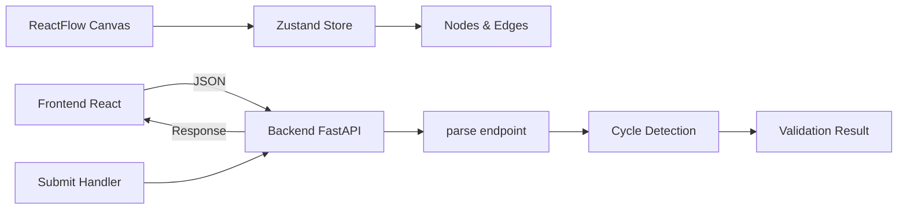

# Pipeline Builder Application

This application is a modern, modular visual pipeline builder that allows users to construct, configure, and validate processing pipelines. It features a React-based frontend with a custom dark theme and a Python FastAPI backend for graph validation.

## 🚀 Features

*   **Visual Editor**: Drag-and-drop interface for creating node-based workflows.
*   **Modular Architecture**: Extensible node system with a common `BaseNode` component.
*   **Custom Dark Theme**: Professional "VectorShift"-inspired UI built with Tailwind CSS.
*   **Node Types**:
    *   **Core**: Input, Output, LLM, Text (auto-resizing with dynamic variables).
    *   **Logic**: Filter, Transform.
    *   **Utility**: API Request, Note, Timer.
*   **Pipeline Validation**:
    *   Real-time structural validation (Cycles/DAG detection).
    *   Backend processing to count nodes and edges.
*   **Dynamic Interactions**:
    *   Text nodes automatically generate handles based on variable syntax `{{var}}`.
    *   Interactive toolbar and minimap.

## 🏗️ Architecture

The application follows a decoupled client-server architecture:



## 🛠️ Project Structure

```
.
├── backend/
│   └── main.py              # FastAPI application & DAG validation logic
├── frontend/
│   ├── public/              # Static assets
│   ├── src/
│   │   ├── nodes/           # Node components
│   │   │   ├── newNodes/    # Logic & Utility nodes (Filter, API, etc.)
│   │   │   └── BaseNode.js  # Common wrapper for unified styling
│   │   ├── ui/              # Reusable UI components (Button, Snackbar)
│   │   ├── App.js           # Main layout & routing
│   │   ├── store.js         # Zustand state management
│   │   ├── submit.js        # Pipeline submission logic
│   │   └── index.css        # Global styles & Tailwind directives
│   ├── tailwind.config.js   # Theme configuration
│   └── package.json         # Frontend dependencies
└── README.md                # Project documentation
```

## ⚙️ Setup & Installation

### Backend

The backend uses Python 3.8+ and FastAPI.

1.  Navigate to the backend directory:
    ```bash
    cd backend
    ```
2.  Install dependencies (if a requirements.txt existed, otherwise install manually):
    ```bash
    pip install fastapi uvicorn
    ```
3.  Start the server:
    ```bash
    uvicorn main:app --reload
    ```
    The API will be available at `http://localhost:8000`.

### Frontend

The frontend is a React application built with Tailwind CSS.

1.  Navigate to the frontend directory:
    ```bash
    cd frontend
    ```
2.  Install dependencies:
    ```bash
    npm install
    ```
3.  Start the development server:
    ```bash
    npm start
    ```
    The application will run at `http://localhost:3000`.

## 📖 Usage Guide

1.  **Creating Nodes**: Drag nodes from the toolbar (Input, LLM, Text, Filter, etc.) onto the canvas.
2.  **Connecting**: Drag from a handle (circle) on one node to a handle on another to create an edge.
3.  **Configuring**:
    *   **Text Node**: Type text. Use `{{variable}}` to create dynamic inputs.
    *   **API Node**: Select method and enter URL.
    *   **Filter/Transform**: Use dropdowns to configure logic.
4.  **Validating**: Click "Submit" in the header.
    *   A **Green** notification means the pipeline is valid (DAG).
    *   A notification indicating "DAG: No" implies a cycle exists.

---
*Built for the Frontend Technical Assessment.*
